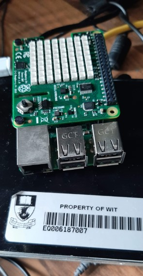

# Project 2 Assignment 

#### **Student Name:** Frank Walsh,**Student ID**: 200712343

This is  a description of my project. It does the following stuff: 

- point 1
- point 2 very important
- point 3

more text.

If you want you can create a graphic/logo for your project: 

**This is in bold**

## Tools, Technologies and Equipment

These are the tools and technologies I used:

### Programming Languages 
* Python

### Tools
* Wyliodrin
* VS Code

### Equipment
* Raspberry Pi

You could include pictures of your set up...

